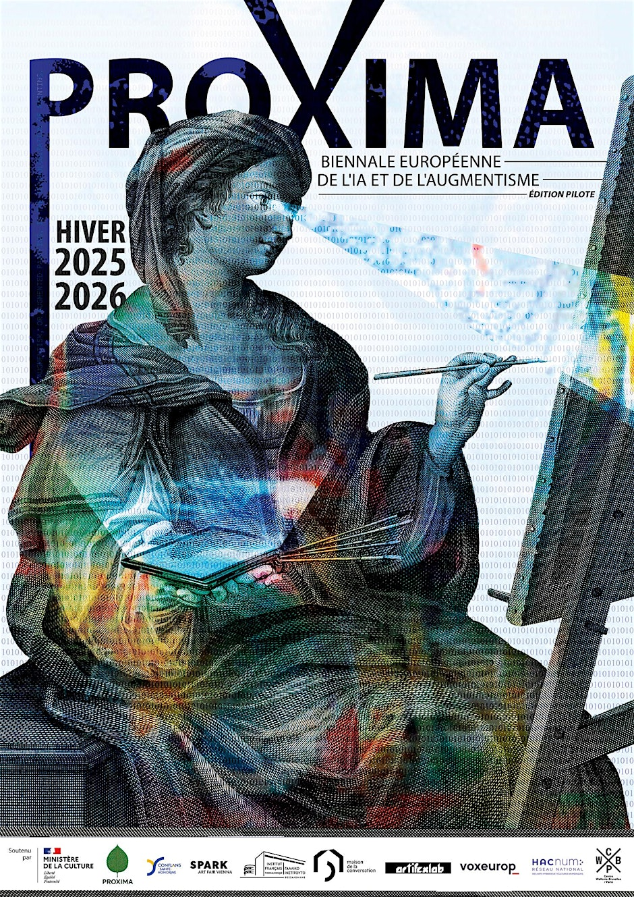

We’re pleased to share an upcoming event organised by one of our community members, Alexandra Boucherifi-Kornmann: PROXIMA, a new European biennale dedicated to the intersections of art, artificial intelligence, and augmentation technologies, supported by the French Ministry of Culture.

Starting in January 2026, in France and abroad, PROXIMA will bring together exhibitions and round tables exploring how AI and so-called “augmentation technologies” (augmented reality, mapping, QR codes, mixed reality) are reshaping pictorial creation.

## 🔬 A laboratory edition: La Piccola

PROXIMA will open with a laboratory (pilot) edition, conceived as a testing ground ahead of the biennale’s full deployment. Developed without dedicated funding, this first iteration is made possible through the voluntary involvement of artists, researchers, and partners united by the desire to help shape a new European cultural event.

Running from January to April 2026, the programme will unfold across multiple venues, with most exhibitions and talks freely accessible to both the general public and experts.

## 🎯 Purpose & scope

PROXIMA aims to:

- highlight artistic practices integrating AI and augmentation technologies,

- examine their aesthetic, philosophical, and ethical implications,

- foster dialogue between art, technology, and research across Europe.

> Augmentism applies technology to pigment in order to question our contemporary obsession with human augmentation, both artistically and philosophically.

— Alexandra Boucherifi-Kornmann

PROXIMA positions itself as a space for experimentation and dialogue between artists, researchers, and the wider public — and as a prefiguration of a future European biennale devoted to AI-driven artistic creation.

## Links & Registration

### Programme highlights

- **📅 15 January 2026 — from 6:30pm to 8:30pm**  
  **📍 La Maison de la Conversation**  
  12 Rue Maurice Grimaud, 75018 Paris  
  **🖌️ Hybrid Materials: Painting in the Age of Augmentism and AI**  
  This round table explores how art-augmenting technologies — from augmented reality and intelligent pigments to AI — transform pictorial matter and redefine the boundaries between art, science, and perception.  
  **With:** Luis Meyer, SUN7, ABK, Etienne Mineur, Yuri Zupancic, the Continuum collective, Aurélien Guiho.
  **Register here:** [eventbrite](https://www.eventbrite.com/e/billets-proxima-biennale-europeenne-de-lia-et-de-laugmentisme-gratuit-1978791094431)

- **📅 16 January 2026 — from 6:30pm to 8:30pm**  
  **📍 La Maison de la Conversation**  
  12 Rue Maurice Grimaud, 75018 Paris  
  **🤖 AI and Creation: Coding the Imaginary or Hacking the Creative Gesture?**  
  This discussion examines human–machine co-creation and the new horizons of imagination in the age of AI, addressing how creative gestures, authorship, and artistic practices are being reconfigured, alongside their ethical, philosophical, and aesthetic implications.  
  **With:** ORLAN, Olga Kisseleva, Jean-Claude Heudin, Maurice Benayoun, Kalon Glaz, Alexandre Bretel, ABK.
  **Register here:** [eventbrite](https://www.eventbrite.com/e/proxima-biennale-europeenne-de-lia-et-de-laugmentisme-gratuit-1601-tickets-1979635453933)

- **📅 17 January 2026 — from 2:30pm to 5pm**  
  **📍 La Maison de la Conversation**  
  12 Rue Maurice Grimaud, 75018 Paris  
  **🎨 AI and Creation: Coding the Imaginary or Hacking the Creative Gesture?**  
  A continuation of the exploration of AI-driven artistic co-creation, featuring exchanges between artists and researchers, followed by an **AI prompting workshop led by Obvious**.  
  **With:** Obvious, Alexandra Gilliams, Daphné Greiner, Aïda Elamrani, Etienne Mineur, Sophia Kourkoulakou (Continuum collective), Yacine Aït Kaci.
  **Register here:** [eventbrite](https://www.eventbrite.com/e/proxima-biennale-europeenne-de-lia-et-de-laugmentisme-gratuit-tickets-1979635929355)

More details:
[LinkedIn](https://www.linkedin.com/company/proximabiennial/)
[Facebook](https://www.facebook.com/people/Proxima-biennial/61583923533871/)
[Instagram](https://www.instagram.com/proximabiennial/)

