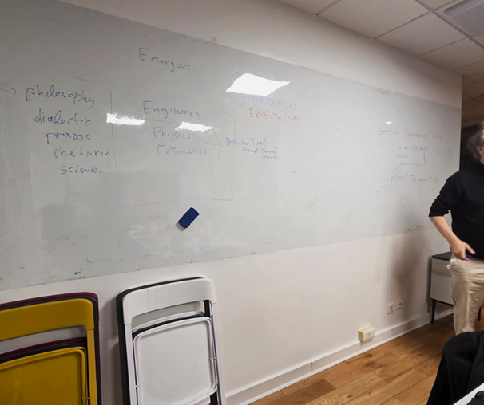

## What is AI-Phi?

AI-Phi is a research community in Paris that operates at the
intersection of AI and philosophy. Its purpose is to set the stage for
social and intellectual gatherings that nurture connections, discussion
and debate among diverse individuals.

## What is a Causerie?

A traditional seminar typically showcases a single expert's perspective,
often leaving the audience in the background, in a passive role. In
contrast, we wanted to create a space where individuals could actively
contribute, bringing their unique research contexts and personalities
into an open-form, relaxed discussion. To achieve this, we took
inspiration from the French concept of a _causerie_---a term
originating from the Parisian salons, where intellectuals engaged in
informal yet thought-provoking discussion.

## Contents

## Our Causerie

The causerie was presented by Edmund Ronald, who did his Ph.D thesis at
Ecole Polytéchnique, on evolutionary neural network training for control
applications, and was one of the founders of the Artificial Evolution
conference series. Edmund opted to not use slides for the causerie.
Instead, we turned around to face the white board of our seminar room at
Sony CSL where he listed out key words as talking points which we
discussed in rough sections.

The topic of the causerie was motivated by the rapid spread of
generative AI into everyday life, even though our collective
understanding of what these systems are, how they behave, and how they
should be governed is largely unresolved. Public narratives oscillate
between extraordinary promise and existential fear, often without a
shared conceptual ground on which those claims can be evaluated.

The way we form a conceptual grounding is related to our mode of
reasoning. Some of the different modes of reasoning include: pragmatic
reasoning that focuses on usefulness, engineering reasoning that accepts
uncertainty and partial understanding, and rhetorical reasoning that
persuades, reassures, or alarms. We discussed how these modes are often
inadequate and conflated. As a result, claims about safety, control,
capability, or inevitability often outpace the forms of reasoning
required to justify them.

A key thread running through the causerie was the growing gap between
engineering realities and public expectations. In practice, engineers
treat complex systems as provisional and fallible. Models approximate
reality, failures are expected, and trust is built inductively over time
through use and observation. In public and political discourse, however,
generative AI is increasingly framed as something that must either work,
be safe, or be regulated in absolute terms. This demand for certainty
clashes with the nature of the systems themselves.

We discussed how this uncertainty is inherent in AI systems as they are
emergent rather than algorithmic. Emergent systems cannot be fully
predicted from their design, nor exhaustively tested in advance.
Understanding such systems requires observation, experimentation, and
continuous revision, rather than complete explanation. This challenges
our ideas of control, accountability, and regulation, all of which
assume that behaviour can be specified in advance and that failure
states can be traced back to engineering decisions and implementation
details.

Hopes and fears were shown to be deeply connected rather than opposing
factors. The same properties that fuel hope, such as rapid growth,
automation and augmentation of human capacity, also served as the basis
for many fears. Hopes for scientific discovery, collective intelligence,
and reduced cognitive overhead coexist with fears of manipulation,
misaligned autonomy, corporate incentives overriding safety, and systems
optimising objectives in ways that exceed human control. In several
cases, fear was less about malicious intent than about systems working
too well within poorly understood or poorly governed constraints.

Many of our hopes and fears relate to trust. We discussed how much of
our trust in technology does not come from deep understanding, but from
familiarity and predictability. When a system works well enough, often
enough, we stop asking questions and just use them. One of the issues of
this approach is that large language models excel at surface level
language usage. They are apparently knowledgeable, articulate and
confident about it. This can encourage users to defer their judgment to
AI systems, sometimes without even realising it.

While there might have been a time for the cautious rolling out of AI
systems, the cat is already out of the bag. AI systems are already
silently influencing society. In the face of this, it\'s unclear what
regulations might look like other than an elaborate and slow game of
whack-a-mole against an evolving target.

After the causerie, we continued our discussion, as we normally do,
somewhere along Rue du Pot de Fer in the Latin Quarter of Paris. Edmund,
who is also our own unofficial AI-Phi sketch artist, pulled out his
water colours and pad and captured the likeness of people at the event.
This was his creation.

## Individual Contributions

### New agencies reshaping our autonomy, by David Colliaux

**Socials**:
[https://kodda.github.io/millieues/](https://kodda.github.io/millieues/)

Among the concerns raised by recent advances in AI is the potential loss
of human autonomy. As noted by Carina Prunkl \[1\], this loss can be
understood as having two distinct components. The first concerns
**authenticity**: we may become less certain that our beliefs are truly
our own. For instance, most videos on YouTube are consumed after passive
scrolling rather than through active search. In such contexts, adaptive
preference formation can lead individuals to increasingly prefer,
endorse, or believe whatever is recommended by the algorithm.

The second component concerns **agency**, understood as the degree to
which we are free and in control of our actions. AI systems may
constrain this freedom by learning, through their optimization
processes, how to nudge or even coerce users into specific behaviors. In
this sense, autonomy is not only shaped by what we believe, but also by
what we are led to do.

As we increasingly complement our thinking with LLM-based chatbots, an
important question arises: can we still be confident that these thoughts
are our own? Moreover, will economic interests infiltrate our cognition
through sponsored content or advertising embedded in AI systems? To
address this emerging form of human--machine interaction, Xabier
Barandiaran and Marta Pérez-Verdugo introduced the concept of
**generative misintended cognition** \[2\]. This notion captures the act
of "thinking with thinking things," resulting in a hybrid form of agency
between humans and AI.

Importantly, they argue that humans can actively harness this
midintended cognition to resist passive alignment with algorithmic
suggestions, instead using AI as a stimulus to generate original and
even oppositional ideas. This dynamic interplay between humans and their
AI tools echoes Andrew Pickering's fluid conception of agency \[3\].
From this perspective, agency is not fixed but emerges through ongoing
interaction, prompting us to rethink ourselves as humans endowed with
extended---and evolving---forms of cognition.

\[1\] Prunkl, C. (2022). Human autonomy in the age of artificial
intelligence. _Nature Machine Intelligence_, _4_(2), 99-101.

\[2\] Barandiaran, X. E., & Pérez-Verdugo, M. (2025). Generative
midtended cognition and Artificial Intelligence: thinging with thinging
things. _Synthese_, _205_(4), 137.

\[3\] Pickering, A. (2024). What is agency? A view from science studies
and cybernetics. _Biological Theory_, _19_(1), 16-21.

### Question: What makes one AI more ethical than another? by Frédéric Keryer

**Socials**: https://www.linkedin.com/company/funartech

Firstly, it needs to comply with regulations, human values, the AI Act,
GDPR and others. The more ethical AI would be one which can prove, with
evidence that everyone can verify, that it satisfies these requirements.
This needs to be verified through both quantitative and qualitative
approaches because zero-risk scenarios don't exist, and ethics in the
real world cannot guarantee that no individual gets penalised. Instead,
it should mitigate risks, lowering the probability that someone gets
hurt, and the system will be forced to improve.

Then, even though we discuss ethical AI extensively, we should also
incorporate multiple pillars into AI systems when considering their
relationship with human beings. We shouldn't just ask, "Is it ethical?",
but we should start to ask, "Does it pass ethics, safety,
sustainability, political, economy, and governance?"

Last but not least, for a joke and because I know Mickael will like it:
"causerie" is a concept we (the French) stole from Ancient Greece. Their
causerie was the Symposium, which, funnily enough, literally means
"drinking together". I suppose that the French were/are maybe more
Bourgeois than aristocratic with their causeries. I always knew Scottish
guys were a bit of French.

### Are we as resistant to AI persuasion as we think we are? by Ali Shiravand

**Socials**: PhD Student in Cognitive Neuroscience at the École Normale
Supérieure (ENS Paris)\
[https://www.linkedin.com/in/ali-shiravand/](https://www.linkedin.com/in/ali-shiravand/))

\
Most of us like to think that we are not easily persuaded by a machine.
We tend to imagine persuasion as something uniquely human, shaped by
emotion, experience, and personal judgment. Yet the way we talk about AI
today already shows how powerful language can be. Public narratives,
media stories, and confident claims from industry leaders often shape
expectations long before people understand the underlying technology.
This mix of reasoning and rhetoric creates the perfect setting for AI
systems that can generate arguments fluently and confidently, raising
the question of how resistant we truly are to their influence - as
persuasion is not always a purely rational process.\
A helpful way to understand persuasion comes from Icek Ajzen's [Theory
of Planned
Behavior](https://link.springer.com/chapter/10.1007/978-3-642-69746-3_2).
It proposes that 1) our beliefs about a topic, 2) our sense of what
others expect from us, and 3) our perceived ability to act shape how we
form our attitudes and behavior. According to this theory, in simpler
terms, persuasion works when a message shifts one of these elements. A
very recent study published in Science tested whether conversational AI
is capable of political persuasion ([Hackenberg et al.,
2025](https://www.science.org/doi/full/10.1126/science.aea3884)).
In this large study, researchers analyzed over 91,000 conversations on
707 political issues involving more than 76,000 people in the UK. They
found that AI shifts people's beliefs mainly by delivering a high volume
of information in a short time, even though not all of that information
is factually correct. Established human-like techniques such as
storytelling or moral framing, had minimal impact, and personalization
mattered very little. What made AI persuasive was the density of
information that felt confident and relevant, even when some details
were inaccurate.

So yes, we may be more susceptible to AI rhetoric than we would like to
think. Not because AI understands us emotionally, but because it
delivers information in a way that feels reasonable and helpful. When we
receive many arguments in a short amount of time, it becomes difficult
to pause, question, or verify them. That is often where persuasion
quietly takes hold.

### What is the limit of the pragmatic evaluation of intelligence? by Michael Anslow

**Socials**:
https://www.linkedin.com/in/michael-anslow-researcher-innovator/

The standard evaluation of the intelligence of generative AI systems is
via benchmarking. Systems that solve more difficult problems across more
diverse domains are more 'intelligent' than ones that solve simpler
problems across more homogenous domains. This is a _pragmatic_ approach
to the evaluation of intelligence. Intelligence is not evaluated as an
intrinsic trait but in terms of externalised intelligence.

This pragmatic approach would eventually reach its limit. As AI systems
can consume so many lifetimes\' worth of knowledge that the collective
sum of our individual paths of inquiry over our lifetimes would fall
entirely within an AI's experience. Beyond that point, it would become
impossible for humans to probe whether the system is genuinely
intelligent or merely imitative, because every test we could devise
would lie within its prior experience. Imitation and understanding would
collapse into the same observable behaviour, not because the distinction
vanishes in principle, but because it becomes epistemically inaccessible
for us to propose novel tasks.

In other words, pragmatic approaches will eventually reach their limit
as model performance saturates performance metrics. Not only the
benchmarks that we currently have, but the benchmarks we could possibly
conceive of. Though this might sound like a purely academic point, long
before we reach this theoretical limit, it will become increasingly
difficult to find meaningful tasks that aren't just rehashed versions of
existing tasks.

**_How might we evaluate a 'strange' AI?_**

Imagine an AI system that had sensory perception quite different to our
own and existed in an environment we were unfamiliar with. This
_strange_ AI would have its own
[umwelt](https://en.wikipedia.org/wiki/Umwelt): perceptual
and cognitive landmarks that its synthetic biology and experiences are
specialised for. While we might share some fundamental features such as
contrast, intensity and regularity, this strange AI might have built a
very different cognitive landscape on top of these features. In this
context, it might be difficult to design meaningful benchmarks that
assess its raw capacity for intelligence, as it would likely fail at
most of our benchmarks using the pragmatic approach (particularly on
human-centric benchmarks). Though perhaps benchmarks that involve more
fundamental abstract pattern matching, like the ARC-AGI benchmarks,
might be helpful.

An alternative approach would be to examine the AI's neural architecture
and activity patterns directly. We could probe its mind as we present it
with varying stimuli and measure its internal cognitive structure and
dynamics. Unlike pragmatic approaches, this would be a direct assessment
of its underlying neural processing rather than a pragmatic evaluation
of externalised intelligence.

Perhaps there are hallmarks of systematic information processing:
evidence of recurrence, feedback loops, and modular organisation, as
well as signatures of model-based cognition, such as the construction of
predictive world models. Together, these properties point to an
internally coherent system organised around structured representations
of its environment. However, it might be difficult to accurately find
and chart out its domain of meaningful input stimuli. Perhaps its most
complex neural processing is exhibited when it operates on a narrow band
of input stimuli that we simply don't present to it?

### Paradigms and future outlooks, by Aïda Elamrani

The distinction between [_epistēmē_ and
_technē_](https://plato.stanford.edu/entries/episteme-techne/)
was already articulated by the Greeks, as was their close interaction
and necessary collaboration. Scientific knowledge provides abstract
models and theoretical insight; technology offers an empirical
playground in which these models are tested, stretched, and sometimes
broken. It is through technological experimentation that boundaries are
probed, results are produced, and scientific understanding is either
confirmed or challenged. Their relationship is complementary, but not
orderly: science and technology do not follow a simple dance with a
single lead.

In that regard, contemporary AI still occupies a pre-paradigmatic space.
And yet, the exploratory phase is beginning to narrow. Whether the point
of convergence lies a few years ahead or over the next decade remains
unclear, but its contours are now visible. We are approaching a phase in
which technē and epistēmē around AI begin to co-stabilise. The contours
of a [paradigm
shift](https://en.wikipedia.org/wiki/Paradigm_shift) are
becoming visible.

Whether these systems are sentient or not, biological or not, whether or
not they match the universality of natural reasoners, one fact already
holds: these machines can manipulate and process symbols and tokens in
ways that are _relevantly effective_. They do so in a manner that is
already useful, and increasingly entangled with our animal societies.
This new step in our technological evolution will answer some
fundamental questions and open up many new ones. The result is still
uncertain, but it is palpably nearing.

Against this background, we can schematise possible futures for AI along
three broad paradigms. These are not predictions, nor value rankings,
but contrasting trajectories with distinct epistemic and institutional
implications.

**Paradigm 1:** Persistent mismatch. We never succeed in building
systems that truly match natural cognitive performance. They remain
powerful yet structurally imperfect tools, sometimes failing in ways
no human ever would, as [Descartes was
predicting](https://en.wikisource.org/wiki/Discourse_on_the_Method/Part_5).

**Paradigm 2:** Natural convergence. As AI systems are refined toward
greater generality, both their performance and architecture
increasingly converge with our own. Intelligence plateaus, yielding
something like silicon counterparts to ourselves.

**Paradigm 3:** Superintelligence. Artificial systems surpass human
epistemic access altogether, producing forms of intelligence whose
internal organisation and informational reach exceed our capacity for
comprehension.

While I'm particularly interested in what these possible futures imply
about consciousness, this is not the place (or appropriate length) to
pursue this line of thought.

What matters here is that these trajectories also bear directly on
another theme raised during the causerie: _regulation_. The
technological race has clearly outpaced our regulatory capacities. And
each of these paradigms leads to different outcomes regarding the
Kafkaesque bureaucratic machines our civilisations have constructed.

Fallible, tool-like systems can already relieve administrative overload,
but they need to remain under careful human oversight. At the opposite
extreme, superintelligence could potentially reveal systemic solutions
to societal problems that exceed our
[prehyperhistoric](https://conscienc.ai/blog/2025-09-11-infosphere-gorniak/)
reach. Lastly, there is the middle way, where AI becomes our digital
cousins: in this case, multiplying agents with human-like reasoning,
limitations, and incentives may do little more than reproduce existing
dysfunctions at scale, accelerating complexity rather than resolving it.

I don't see scenario 2 or 3 happening in 2026. But I'm sure next year
will be full of unexpected surprises. Time will Teller.

_\[Disclosure: An AI language model was used to interactively refine the
original draft of this piece, preserving the ideas and flow while
improving clarity and language.\]_

# Final Remarks

Discussion about AI often devolves into doom vs gloom narratives.
However, our hopes and fears are often different sides of the same coin:
what might be helpful might also be harmful. While some debate is
directed at specific abuses and failures of AI systems, a lot of it is
more broadly related to how AI will affect wider societal issues such as
inequality and socio-economic problems. Many of our responses have been
reactionary and adaptive, rather than preemptive which is understandable
given that we are dealing with an unknown artificial entites with
wide-reaching influence. Here are at AI-Phi we will continue to engage
with this issues as they arise and evolve over time.
